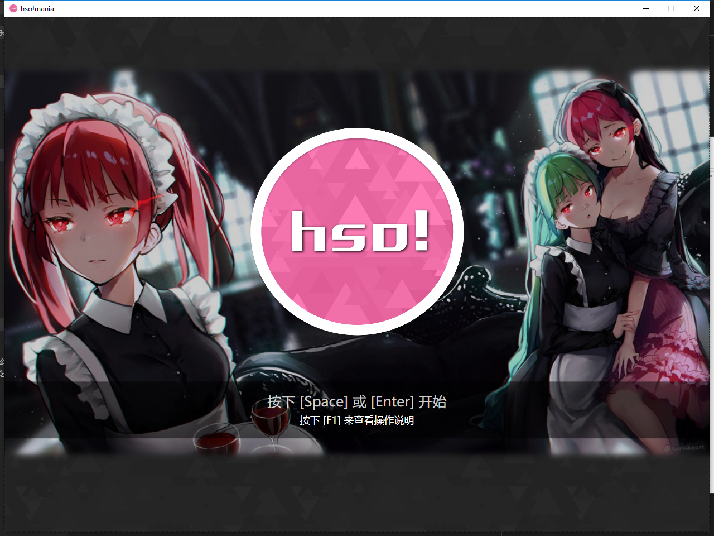
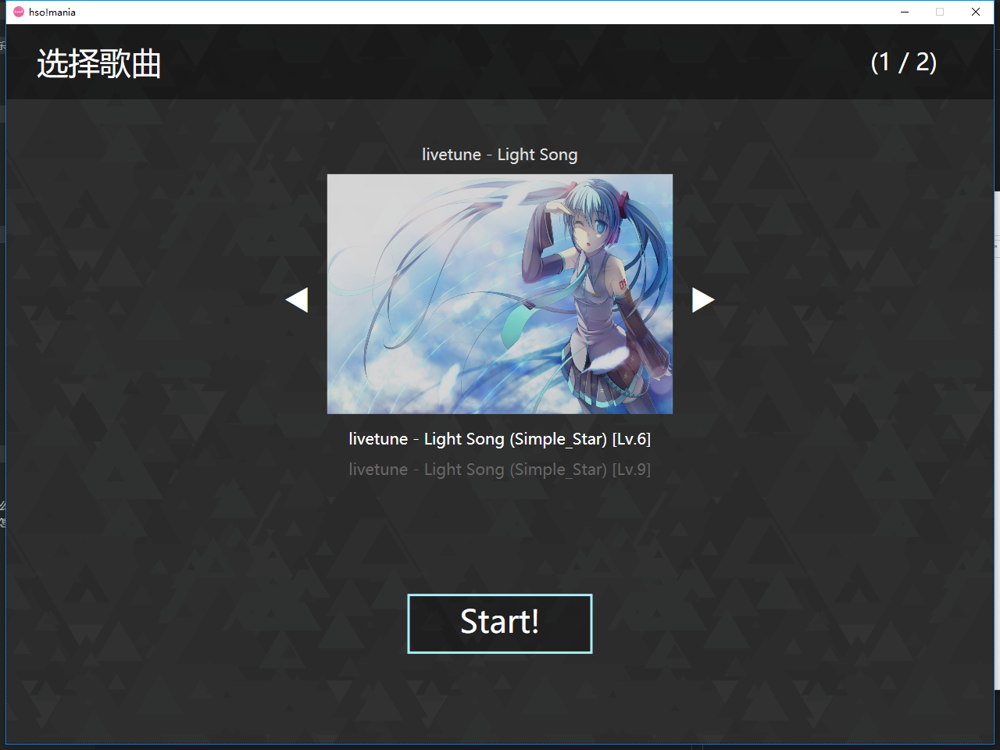
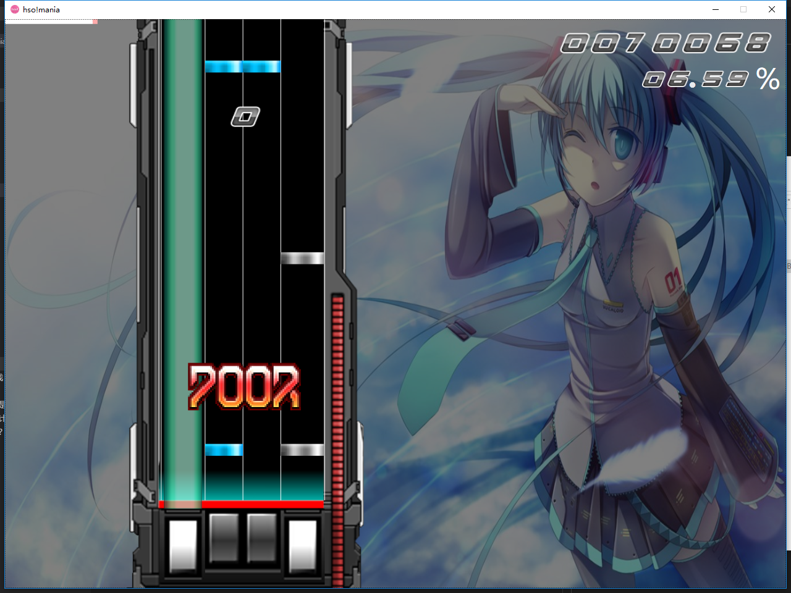
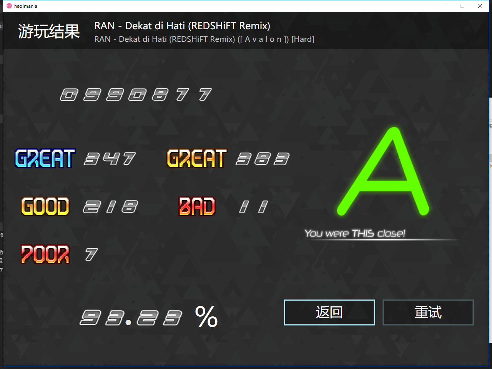

# hso!mania 音乐游戏
- [hso!mania 音乐游戏](#hsomania-音乐游戏)
  - [1. 这是什么？](#1-这是什么)
  - [2. 它的基本功能是什么？](#2-它的基本功能是什么)
  - [3. 程序的大体设计是怎样的？](#3-程序的大体设计是怎样的)
  - [4. 运行截图](#4-运行截图)
  - [5. 如何编译运行？](#5-如何编译运行)
    - [编译](#编译)
    - [执行](#执行)
## 1. 这是什么？
这是我的 `C#` 课程设计，虽说这门课原本的名字叫做 `面向对象程序设计`，但其实设计模式也都没讲，大部分都是 `C#` 语法和 `WPF`（  
当时不知道想做什么内容，脑子里浮现了一个想法，简单做一个音游吧！然后就开始瞎写代码了，大体是参照 `osu!mania` 来做的，再然后 `hso!mania` 就诞生了...  
不过如果当作游戏来看的话... 这个东西的质量其实非常糟糕，因为是拿 WPF 写的，也没有用其他引擎，动画那些都很简陋，体验也比较一般（逃），所以单纯当作一个用来水的课程设计来看就可以了（毕竟从开始到测试完也就写了两三天，每天还到处玩的那种）

## 2. 它的基本功能是什么？
* 一个简陋的下落式音乐游戏
* 实现了读取 osu 谱面数据文件（4K only，纯 key 音组成的谱面不支持，不支持的谱面会直接不显示）
* 能够正常游玩并评价游玩结果
* UI 不算反人类
* 能够调速
* 不支持谱面变速，前导间隙等（因为懒得写）

## 3. 程序的大体设计是怎样的？
请参见当时的课程设计文档（[report.pdf](report.pdf)），关于大体的架构设计、缺点、分数计算公式等都在里面有描述。  
而较详细的编码过程可以看 git 提交记录和代码，因为一开始我就用 git 在管理代码了，中途也经历过一次较大的架构变动（毕竟是面向对象程序设计课程设计，~~不多创建几个对象怎么行~~）

## 4. 运行截图
  
  

## 5. 如何编译运行？
### 编译
> 我是在 VS2015 (14.0) 的环境编码的，小于这个版本的 VS 不一定保证能够编译成功（？）

建议直接用 `Visual Studio ` 吧，打开 `sln` 解决方案文件即可，虽然挺重的但毕竟 `WPF` 是微软家的东西，我还没有研究过用命令行编译，如果有尝试过的小伙伴知道的话也可以直接提交 PR。  
编译后会生成可执行文件，**但无法直接运行**，因为我是从外部读取皮肤资源的（逃）

### 执行
1. 使用 VS 或者其他任何途径编译得到可执行文件 `hso!mania.exe`
2. 拷贝到 `bin` 文件夹里，因为程序依赖的皮肤文件夹在这里
   * 或者把 `Skins` 文件夹和 `Songs` 文件夹拷贝到可执行文件同目录即可
3. 从你的 `osu` 的歌曲目录里随便复制一些 4K 的谱面到 `Songs` 文件夹里，或者直接下载我的这个项目（里面附了两首歌，可以直接游玩）
4. 双击运行可执行程序

---
我的博客： https://blog.tamce.cn  
我的个人公众号：  

